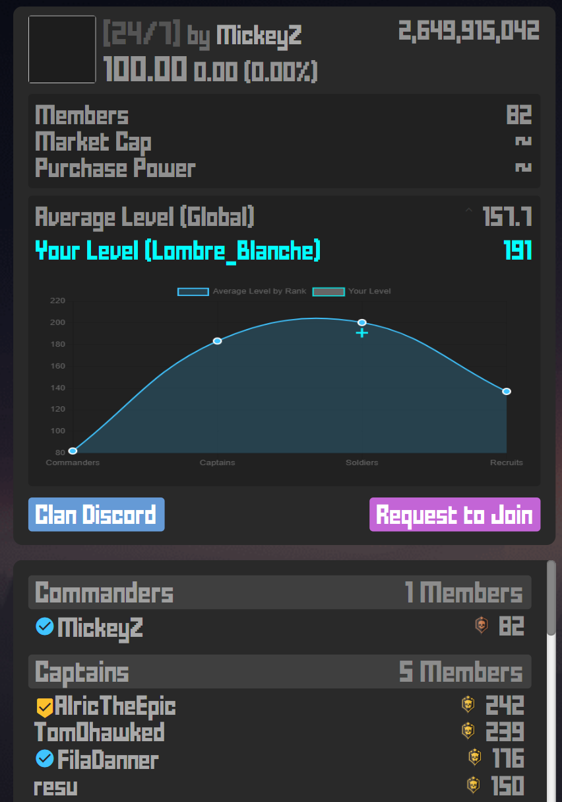

Yes its a chatGPT readme.

# **Clan Level Statistics & Chart for Krunker.io**

*A lightweight userscript that displays level statistics and a visual chart of clan members across all ranks in **Krunker.io**.*

---

## **📦 Available Scripts**

### **`statsclanhub.js` (Default Version)**
- **Dynamic statistics panel** showing average levels per rank.
- **Interactive line chart** visualizing level progression across ranks.
- **Personal level indicator** highlighting your position in the clan.

---

## **🎯 What Does It Do?**
- **Extracts member levels** from all clan ranks (Commanders, Captains, Soldiers, Recruits).
- **Calculates average levels** for each rank category.
- **Displays a global average** for the entire clan.
- **Shows your personal level** if you're logged in.
- **Renders a line chart** tracking level trends across ranks.
- **Collapsible panel** to save screen space.

---

## **📊 Features**
- **Real-time level analysis** – See average levels per rank instantly.
- **Personal level tracking** – Your level is highlighted in cyan on the chart.
- **Global clan average** – Quick overview of overall clan strength.
- **Interactive chart** – Hover over points to see exact values.
- **Collapsible interface** – Click the header to expand/collapse statistics.
- **Rank-based visualization** – Line chart shows level progression from Commanders to Recruits.
- **Non-intrusive design** – Seamlessly integrates into the existing clan UI.
- **Lightweight & efficient** – Minimal performance impact.

---

## **🚀 Installation**
1. **Copy the script** to your userscripts folder (or browser extension since its the hub).
2. **Ensure Chart.js is loaded** (the script handles this automatically).
3. **Reload your Krunker client**.
4. **Open the clan tab** – the statistics panel will appear automatically.

---


## **📸 Preview**


---

## **💡 How It Works**
1. **Scans the DOM** for clan member elements (`.scrollItem > div`).
2. **Categorizes members** into Commanders, Captains, Soldiers, and Recruits.
3. **Extracts level data** from each member's profile (`.floatR`).
4. **Calculates averages** per rank and globally.
5. **Detects your username** from `localStorage` to highlight your level.
6. **Creates a statistics panel** with collapsible functionality.
7. **Renders a Chart.js line chart** showing level trends.
8. **Adds your level as a cross marker** on the chart (if logged in).

---

## **🔧 Customization**
Want to personalize the stats panel? Modify these in the script:

### **Change Chart Colors:**
```javascript
// In createChart() function
borderColor: 'rgba(64, 196, 255, 1)', // Line color
backgroundColor: 'rgba(64, 196, 255, 0.2)', // Fill color
pointBackgroundColor: 'rgba(64, 196, 255, 1)', // Point color
```

### **Adjust Personal Level Marker:**
```javascript
// Your level marker styling
borderColor: 'rgba(2, 255, 255, 1)', // Cyan color
pointStyle: 'cross', // Change to 'circle', 'star', 'triangle', etc.
pointRadius: 8, // Size of the marker
```

### **Modify Panel Appearance:**
```javascript
// In addStatsPanel() function
newPanel.style.marginTop = '10px'; // Spacing
newPanel.style.padding = '15px'; // Internal padding
// Add custom CSS classes or inline styles
```

### **Change Chart Type:**
```javascript
// In createChart() function
type: 'line', // Change to 'bar', 'radar', etc.
```

---

## **🛠️ Technical Details**

### **Data Collection:**
- Iterates through `.scrollItem > div` elements
- Identifies rank categories by text content
- Extracts levels from `.floatR` elements
- Stores data in categorized arrays

### **Statistics Calculation:**
- Computes average levels per rank
- Calculates global clan average
- Counts members in each rank
- Identifies logged-in user's position

### **Chart Rendering:**
- Uses **Chart.js** for visualization
- Line chart with smooth curves (`tension: 0.4`)
- Dual datasets: clan averages + your level
- Custom tooltips and responsive design

---

## **🐛 Troubleshooting**

### **Chart not appearing:**
- Ensure you're on the clan hub page
- Check that `.clanStatH` element exists
- Verify Chart.js is loaded (script auto-loads it)

### **Your level not showing:**
- Make sure `krunker_username` is stored in localStorage
- Verify your username matches exactly (case-sensitive)

### **Stats not updating:**
- Refresh the page
- Check console for errors (`F12` → Console tab)

---

## **🤝 Contributing**
- **Report bugs** (e.g., incorrect level parsing, chart rendering issues).
- **Suggest features** (e.g., additional rank stats, export functionality).
- **Fork & customize** for your clan's specific needs.
- **Discord**: Lombre_Blanche.br

---

## **📝 Notes**
- **Requires Chart.js** – Auto-loaded via CDN (`https://cdn.jsdelivr.net/npm/chart.js`).
- **localStorage dependency** – Uses `krunker_username` for personal level detection.
- **DOM structure specific** – May break if Krunker updates the clan page layout.
- **Performance optimized** – Runs once on page load, minimal overhead.

---

## **🎨 Rank Colors**
The chart uses distinct visual styles:
- **Clan Average Line**: Blue (`rgba(64, 196, 255, 1)`)
- **Your Level Marker**: Cyan (`rgba(2, 255, 255, 1)`)
- **Background Fill**: Translucent blue for the area under the line
- **Grid Lines**: Subtle white (`rgba(255, 255, 255, 0.1)`)

---
